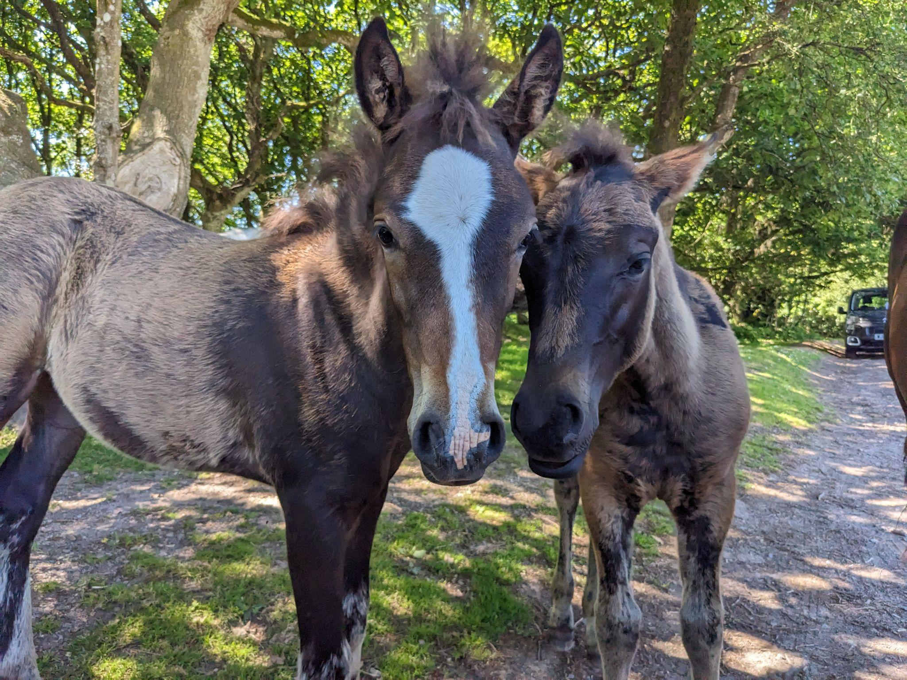

:::::::::::::::::::::::::::::::::::::: questions

* TODO

::::::::::::::::::::::::::::::::::::::::::::::::

::::::::::::::::::::::::::::::::::::: objectives

* TODO

::::::::::::::::::::::::::::::::::::::::::::::::

# File format structures

*  “A standard way that information is encoded for storage in a computer
file. It specifies how bits are used to encode information in a digital
storage medium” – Wikipedia ‘File Format’ entry retrieved 14 August 2024
*  Defined in a **file format specification**, which may or may not be
made public
*  Format identification may possibly be determined by:
  * Extension, e.g. myfile.**docx**
  * Internal metadata, e.g. Magic Numbers, signature sequences
  * External metadata, e.g. Mac OS type-codes
*  Digital objects can consist of individual standalone files,
multi-file/multipart items distributed across a folder/file system/web
URLs, or multi-file/multipart items stored in a single container, e.g.
Zip, OLE

## Standalone Binary Formats {#standalone-binary-formats}

*  Consists of a single file that contains everything needed to be
rendered by appropriate software
*  No overarching, mandatory structure, but common elements include
a **header** containing information about the file, and potentially
a **magic number** that makes file format identification easier
*  Highly portable
*  Examples include: Microsoft Word (.doc) prior to Office ‘95,
Photoshop .psd, GIF, JPEG

.jpg image of two horses

Same .jpg image displayed in a hex editor

File format magic bytes that identify this file format entry in PRONOM

## Multi-part Assets {#multi-part-assets}

*  Consists of multiple files
*  Often co-located, i.e. in a single folder on a file system or across
multiple folders
  * Examples include Advanced Video Coding High Definition (AVCHD),
  Interoperable Master Format (IMF), some iWork versions.
*  Could be distributed across web resources
  * Examples include a web page with separate HTML, JS, CSS elements.

Is a group of files such as jpeg, css, JavaScript, html and more

A website displayed in a browser

## Task: Multi-part assets

Can you think of other multi-part assets? Are there any that you are
working with in your organization?

[www.menti.com](http://www.menti.com) 5136 8099

<!-- NB. Keypoints should appear at the end of the markdown file. Aesthetically
     it looks like it's better with an additional newline so adding that
     here and using this comment as a separator to make it easy to read
     content.
-->

 

::::::::::::::::::::::::::::::::::::: keypoints

* TODO...

::::::::::::::::::::::::::::::::::::::::::::::::
