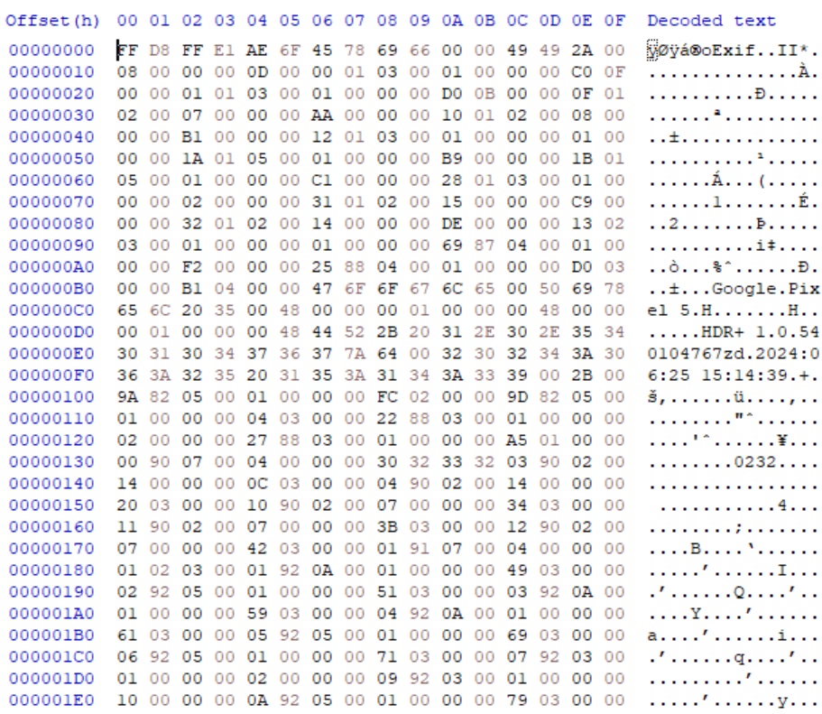
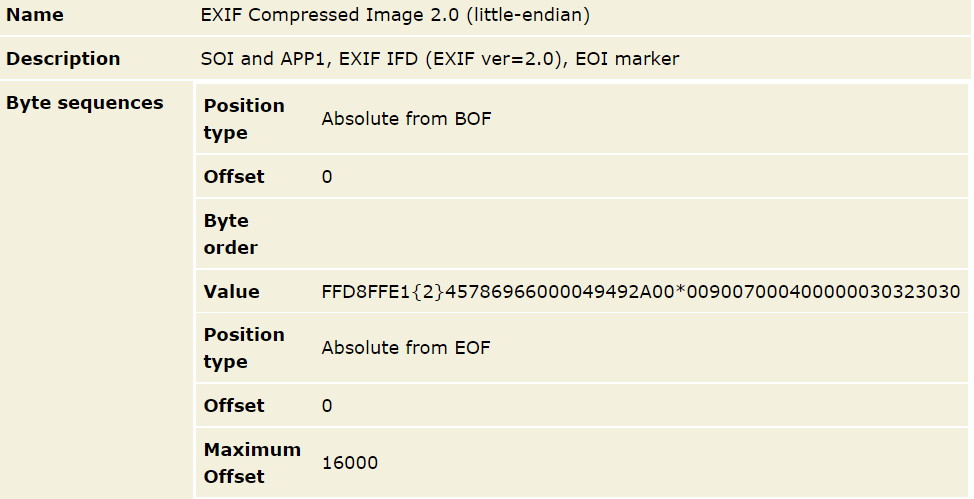

:::::::::::::::::::::::::::::::::::::: questions

* How are digital files structured?
* What information is provided by a specification?
* What do different representations of digital file look like?

::::::::::::::::::::::::::::::::::::::::::::::::

::::::::::::::::::::::::::::::::::::: objectives

* Understand the basic structure of a file format
* Recognize different file format representations

::::::::::::::::::::::::::::::::::::::::::::::::

# File format structures

*  “A standard way that information is encoded for storage in a computer
file. It specifies how bits are used to encode information in a digital
storage medium” – Wikipedia ‘File Format’ entry retrieved 14 August 2024
*  Defined in a **file format specification**, which may or may not be
made public
*  Format identification may possibly be determined by:
  * Extension, e.g. myfile.**docx**
  * Internal metadata, e.g. Magic Numbers, signature sequences
  * External metadata, e.g. Mac OS type-codes
*  Digital objects can consist of individual standalone files,
multi-file/multipart items distributed across a folder/file system/web
URLs, or multi-file/multipart items stored in a single container, e.g.
Zip, OLE

## Standalone Binary Formats {#standalone-binary-formats}

*  Consists of a single file that contains everything needed to be
rendered by appropriate software
*  No overarching, mandatory structure, but common elements include
a **header** containing information about the file, and potentially
a **magic number** that makes file format identification easier
*  Highly portable
*  Examples include: Microsoft Word (.doc) prior to Office ‘95,
Photoshop .psd, GIF, JPEG

{alt=".jpg image of two horses"}

{alt="Same .jpg image displayed in a hex editor"}

{alt="File format magic bytes that identify this file format entry in PRONOM"}

<!-- NB. Keypoints should appear at the end of the markdown file. Aesthetically
     it looks like it's better with an additional newline so adding that
     here and using this comment as a separator to make it easy to read
     content.
-->

 

::::::::::::::::::::::::::::::::::::: keypoints

* Specifications are often used to describe file formats
* Specifications become standards
* External metadata can be used to identify a file format
* The internal (binary) structure can be used as well but we need to use
a hex editor to do this

::::::::::::::::::::::::::::::::::::::::::::::::
