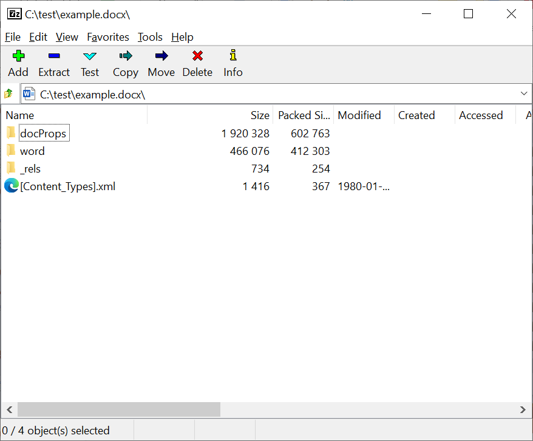
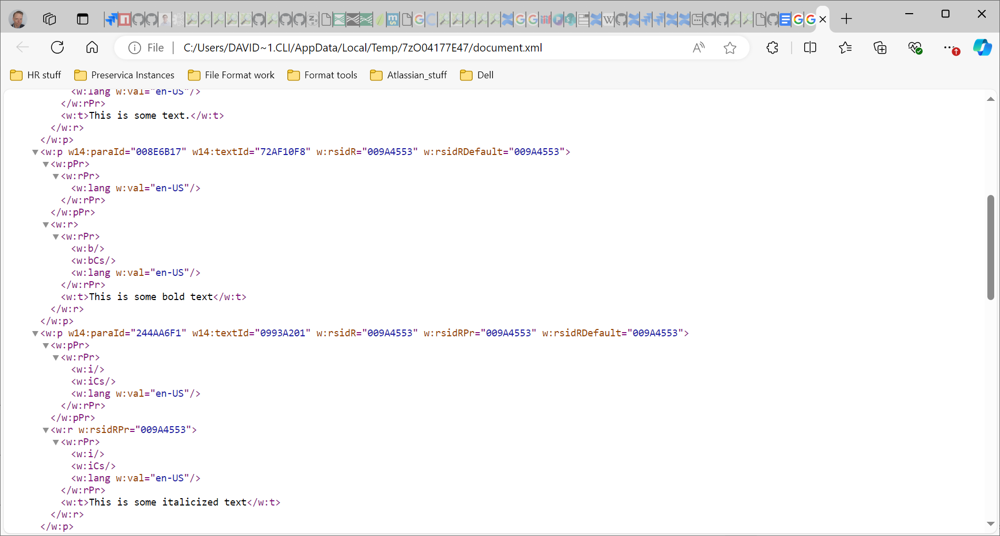

:::::::::::::::::::::::::::::::::::::: questions

* TODO

::::::::::::::::::::::::::::::::::::::::::::::::

::::::::::::::::::::::::::::::::::::: objectives

* TODO

::::::::::::::::::::::::::::::::::::::::::::::::

# Microsoft Word DOCX Format

*  Structurally follows the Office Open XML standard \- ISO/IEC
29500, ECMA-376
*  Is a **Zip** file, containing mostly **XML** files
*  XML files define the structure of the document, along with any
textual and formatting elements
*  XML files also control the **meta-structure**, describing where other
file elements can be found within the zip
*  Embedded objects (such as images) are stored in full
*  Can be unpacked or explored with a tool such as 7zip, or through Windows
Explorer after changing the file extension to .zip
*  May also contain a thumbnail image of the rendered document

## The Microsoft Word DOCX Format

{alt="TODO"}

![A screenshot of the 7zip application demonstrating the internal structure of a Microsoft Word DOCX document. This image shows the root of the zip container, which has the \[Content\_Types\].xml used for identification purposes](./fig/docx-structure-2.png){alt="TODO"}

{alt="TODO"}

## Task: Exploring a Container Format

Explore a Word, Excel, or PowerPoint document and discuss what you see
and any interesting findings with your peers.

> The container can be accessed by using a tool such as 7-zip to unpack
the contents, or by changing the file extension to .zip,*

[www.menti.com](http://www.menti.com) 5136 8099

<!-- NB. Keypoints should appear at the end of the markdown file. Aesthetically
     it looks like it's better with an additional newline so adding that
     here and using this comment as a separator to make it easy to read
     content.
-->

 

::::::::::::::::::::::::::::::::::::: keypoints

By the end of this workshop, you should be able to:

* TODO...

::::::::::::::::::::::::::::::::::::::::::::::::
