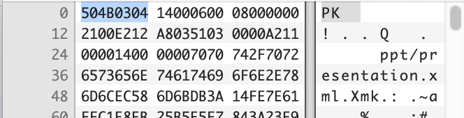

:::::::::::::::::::::::::::::::::::::: questions

* TODO

::::::::::::::::::::::::::::::::::::::::::::::::

::::::::::::::::::::::::::::::::::::: objectives

* TODO

::::::::::::::::::::::::::::::::::::::::::::::::

# Binary Signature File Format Identification

* A PRONOM file format entry can be associated with zero-to-many file
format signatures. Matching any signatures will return a hit
* A File Format signature can be anchored to the beginning of the file (BOF),
the end of the file (EOF), or at a variable (VAR) location within the file.
It can also be offset to the BOF or EOF, either absolutely, or by a range
* Binary signatures in PRONOM are *always* expressed using **hexadecimal**
notation

Binary Signature File Format Identification additional syntax

* **??**: wildcard matching any pair of hexadecimal values (i.e. a single byte).

  e.g.: 0x0A FF ?? FE would match 0x0A FF 6C FE or 0x0A FF 11 FE.

* **\***: wildcard matching any number of bytes (0 or more).

  e.g.: 0x0A FF \* FE would match 0x0A FF 6C FE or 0x0A FF 6C 11 FE.

* **{n}**: wildcard matching n bytes, where n is an integer.

  e.g.: 0x1C 20 {2} 4E 12 would match 0x1C 20 FF 15 4E 12\.

* **{m-n}**: wildcard matching between m-n bytes inclusive, where m and n are
integers or ‘\*’.

  e.g.: 0x03 {1-2} 4D would match 0x03 3C 4D or 0x03 3C 88 4D.
  e.g.: 0x03 {2-\*} 4D would match 0x03 3C 88 4D or 0x03 3C 88 3F 4D.

Binary Signature File Format Identification additional syntax

* **(a|b)**: wildcard matching one from a list of values (e.g. a or b), where
each value is a hexadecimal byte sequence of arbitrary length containing no
wildcards.

  e.g.: 0x0E (FF|FE) 17 would match 0x0E FF 17 or 0x0E FE 17\.

* **\[a:b\]**: wildcard matching any sequence of bytes which lies
lexicographically between a and b, inclusive (where both a and b are byte
sequences of the same length, containing no wildcards, and where a is
less than b).

  e.g. 0xFF \[09:0B\] FF would match 0xFF 09 FF, 0xFF 0A FF or 0xFF 0B FF.

* **\[\!a\]**: wildcard matching any sequence of bytes other than a itself
(where a is a byte sequence containing no wildcards).

  e.g. 0xFF \[\!09\] FF would match 0xFF 0A FF, but not 0xFF 09 FF.

Binary Signature File Format Identification additional syntax

* **\[\!a:b\]**: wildcard matching any sequence of bytes which does not
lie lexicographically between a and b, inclusive (where a and b are both
byte sequences of the same length, containing no wildcards, and where a is
less than b)

  e.g. 0xFF \[\!01:02\] FF would match 0xFF 00 FF and 0xFF 03 FF, but
  not 0xFF 01 FF or 0xFF 02 FF.

## Binary Signature File Format Identification example - ZIP

| Name | ZIP Format Signature 1 |  |
| :---- | :---- | :---- |
| Byte sequences | Position type | Absolute from BOF |
|  | Offset | 0 |
|  | Maximum Offset | 4 |
|  | Value | 504B0304 |
|  | Position type | Absolute from EOF |
|  | Offset | 0 |
|  | Byte order | Little-endian |
|  | Value | 504B01{43-65531}504B0506{18-65531} |
| Name | ZIP Format Signature 2 |  |
| Byte sequences | Position type | Absolute from BOF |
|  | Offset | 0 |
|  | Maximum Offset | 0 |
|  | Value | 504B05060000 |

<!-- NB. Keypoints should appear at the end of the markdown file. Aesthetically
     it looks like it's better with an additional newline so adding that
     here and using this comment as a separator to make it easy to read
     content.
-->

 

::::::::::::::::::::::::::::::::::::: keypoints

By the end of this workshop, you should be able to:

* TODO...

::::::::::::::::::::::::::::::::::::::::::::::::
