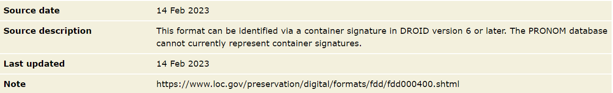

:::::::::::::::::::::::::::::::::::::: questions

* TODO

::::::::::::::::::::::::::::::::::::::::::::::::

::::::::::::::::::::::::::::::::::::: objectives

* TODO

::::::::::::::::::::::::::::::::::::::::::::::::

NB. the xml below needs to be prettified...

# Exploring container signatures

## Task: The Container Signature File

Open the latest container signature file.

In your web browser, or text editor of choice:

Directly:

[https://cdn.nationalarchives.gov.uk/documents/container-signature-20240715.xml](https://cdn.nationalarchives.gov.uk/documents/container-signature-20240715.xml)

Or via PRONOM > DROID Signature Files > 15 July 2024 (at the bottom of the page):

[https://www.nationalarchives.gov.uk/PRONOM](https://www.nationalarchives.gov.uk/PRONOM)

## How DROID Identifies Container-based File Formats

* Initial identification of certain container formats acts as a **Trigger**
for DROID to check for container identification matches
* DROID then checks the internal structure of these container format
instances, seeking matching **Paths** to required subfiles (files or
directories within the container)
* If a matching path is found, DROID then checks the **InternalSignatures**
of the subfile(s), seeking matching identification **Sequences**
* All elements of a **container signature** must be present for it to return
a hit
* A format (PUID) can have multiple **container signatures**, in which case
matching against any will return a hit
* If no matching **trigger** identification is found, or no matching
**paths** are found, or where declared no matching **sequences** are found,
binary identification continues as normal

## Container signatures in the PRONOM database

* PRONOM won’t show container signatures within the database. If a format
is in the database usually there is a note on the page mentioning that it
has a container signature attached as below.
* Container signatures are not entered into our database in the same way
as binary signatures and can only be seen via the downloaded xml files.
* Container signatures are written manually in xml before being published.
You can therefore see different stylistic decisions that may have been made
within the xml.

{alt="TODO"}

## Container Signature File Structure

Consists of three sections:

* **ContainerSignatures** - the actual signature data that is used to
identify files

* **FileFormatMappings** - the relationship (or key) between formats in
PRONOM proper and Container Signatures

* **TriggerPuids** - the formats in PRONOM that, where initially identified,
will prompt container signature processing and detection

```xml
<ContainerSignatureMapping schemaVersion="1.0" signatureVersion="38">
	<ContainerSignatures>
...
</ContainerSignatures>
	<FileFormatMappings>
...
</FileFormatMappings>
	<TriggerPuids>
...
</TriggerPuids>
</ContainerSignatureMapping>
```

## Container Triggers

The identification of certain container formats acts as a **trigger** for
DROID to check for container identification matches. These triggers are:

* fmt/111: OLE2 Compound Document Format
* fmt/189: Microsoft Office Open XML 2007 Onwards
* x-fmt/263: Zip Format

*> NB: fmt/189 is a specific type of zip*

If your file identifies as any of these then it may well be a candidate
for a container signature!

Triggers are found in the ‘**TriggerPuids**’ section at the bottom of the
Container Signature File:

```xml
<TriggerPuids>
	<TriggerPuid ContainerType="OLE2" Puid="fmt/111"/>
	<TriggerPuid ContainerType="ZIP" Puid="fmt/189"/>
	<TriggerPuid ContainerType="ZIP" Puid="x-fmt/263"/>
</TriggerPuids>
```

## File Format Mappings

The relationship (or key) between formats in PRONOM proper and Container
Signatures, which includes **SignatureID** and **PUID** attributes.

* **SignatureID** maps to items in the ContainerSignatures section and is
assigned manually by the PRONOM team
* **PUID** maps directly to a PRONOM identifier.
* Includes a comment line containing the format name and usually the
type of container trigger
* A PUID can be mapped to multiple ContainerSignatures by **SignatureID**.
In this case a match against any of the listed container signatures will
return a match

```xml
<!--  Microsoft Word Document 6.0/95 (OLE2) -->
<FileFormatMapping signatureId="1000" Puid="fmt/39"/>
<!--  Microsoft Word Document 97-2003 -->
<FileFormatMapping signatureId="1020" Puid="fmt/40"/>
<!--  Microsoft Word OOXML (ZIP) -->
<FileFormatMapping signatureId="1030" Puid="fmt/412"/>
```

## Container Signature Structures - Overview

* At the top level, Container Signatures consist of an **ID** attribute
which matches the File Format Mapping.
* The **ContainerType** attribute (either ZIP or OLE2) is informational
and relates to the **Trigger**.
* The Description usually matches the format name, but may include
additional information (e.g. ‘variant 2’).
* The **Files** element must exist and contains one or more **File** elements.

```xml
<ContainerSignature Id="1000" ContainerType="OLE2">
	<Description>Microsoft Word 6.0/95 OLE2</Description>
	<Files>
		<File>
...
</File>
		<File>
...
</File>
	</Files>
</ContainerSignature>
```

## Container Signature Structures - Files

* **File** elements contain one to many **Path** elements
* Paths represent a filepath to a resource (directory or file) relative to
the root of the container
* A Container Signature must **minimally** have one File & Path, but can
have many
* A File can have zero-to-many **BinarySignatures**
* A Container Signature must match against all given Paths and
BinarySignatures to return a match

```xml
<Files>
	<File>
		<Path>WordDocument</Path>
	</File>
	<File>
		<Path>CompObj</Path>
		<BinarySignatures>
...
</BinarySignatures>
	</File>
</Files>
```

## Container Signature Structures - Sequences

* A Path can have zero-to-many InternalSignatures
* InternalSignatures represent a byte sequence found within a file specified
by a Path
* An InternalSignature can be formed of many sub-Sequences
* As with binary signatures, InternalSignatures can be positioned relative
to the **BOF**, **EOF**, or **Variable** within the file
* Sequences in a Container Signature can be expressed as hexadecimal, or
ASCII where appropriate (usually standard western alphanumeric characters
from the 7-bit ASCII range). If in doubt use hexadecimal!
* The value of **InternalSignature ID** is arbitrary, but in later versions
we usually match them to the Container Signature ID

## Container Signature Syntax

* Syntax for container signatures can differ from binary signature syntax
* The most obvious of these is the option to write in **ASCII** with
inverted commas or in **hexadecimal** whereas binary signatures are only
written in **hexadecimal**
* Binary signature syntax elements, such as wildcards and byte ranges
cannot be applied in the same way - instead signatures are more similar to
the post-processed versions found in the binary signature file

## Container signature examples

### Container Signature Example - fmt/412

```xml
<ContainerSignature Id="1030" ContainerType="ZIP">
	<Description>Microsoft Word OOXML</Description>
	<Files>
		<File>
**
			<Path>[Content_Types].xml</Path>**

			<BinarySignatures>
				<InternalSignatureCollection>
**
					<InternalSignature ID="302">**

						<ByteSequence Reference="BOFoffset">
							<SubSequence Position="1" SubSeqMinOffset="0" SubSeqMaxOffset="32768">
								<Sequence>'ContentType="application/vnd.openxmlformats-officedocument.wordprocessingml.document.main+xml"'</Sequence>
							</SubSequence>
						</ByteSequence>
					</InternalSignature>
				</InternalSignatureCollection>
			</BinarySignatures>
		</File>
	</Files>
</ContainerSignature>
```

### Container Signature Example - fmt/39

```xml
<ContainerSignature Id="1000" ContainerType="OLE2">
	<Description>Microsoft Word 6.0/95 OLE2</Description>
	<Files>
		<File>
			<Path>WordDocument</Path>
		</File>
		<File>
			<Path>CompObj</Path>
			<BinarySignatures>
				<InternalSignatureCollection>
					<InternalSignature ID="306">
						<ByteSequence Reference="BOFoffset">
							<SubSequence Position="1" SubSeqMinOffset="40" SubSeqMaxOffset="1024">
								<Sequence>10 00 00 00 'Word.Document.' ['6'-'7'] 00</Sequence>
							</SubSequence>
						</ByteSequence>
					</InternalSignature>
				</InternalSignatureCollection>
			</BinarySignatures>
		</File>
	</Files>
</ContainerSignature>
```

Container Signature Example - fmt/1196

```xml
<ContainerSignature ContainerType="ZIP" Id="31020">
	<Description>SIARD 2.1</Description>
	<Files>
		<File>
			<Path>header/siardversion/2.1/</Path>
		</File>
	</Files>
</ContainerSignature>
```

### Container Signature Example - fmt/1190

```xml
<InternalSignature ID="28200">
	<ByteSequence Reference="BOFoffset">
		<SubSequence Position="0" SubSeqMinOffset="0" SubSeqMaxOffset="0">
			<Sequence>3C 3F 78 6D 6C 20 76 65 72 73 69 6F 6E 3D 22 31 2E 30 22 20 3F 3E</Sequence>
		</SubSequence>
	</ByteSequence>
	<ByteSequence Reference="BOFoffset">
		<SubSequence Position="1" SubSeqMinOffset="23" SubSeqMaxOffset="50">
			<Sequence>3C 73 77 63 20 78 6D 6C 6E 73 3D 22 68 74 74 70 3A 2F 2F 77 77 77 2E 61 64 6F 62 65 2E 63 6F 6D 2F 66 6C 61 73 68 2F 73 77 63 63 61 74 61 6C 6F 67 2F</Sequence>
		</SubSequence>
	</ByteSequence>
</InternalSignature>
```

### Container Signature Example - fmt/978

```xml
<ContainerSignature Id="30020" ContainerType="OLE2">
	<Description>3DS Max</Description>
	<Files>
		<File>
			<Path>DocumentSummaryInformation</Path>
			<BinarySignatures>
				<InternalSignatureCollection>
					<InternalSignature ID="30020">
						<ByteSequence Reference="BOFoffset">
							<SubSequence Position="1" SubSeqMinOffset="0" SubSeqMaxOffset="1024">
								<Sequence>33 64 73 20 4D 61 78 20 56 65 72 73 69 6F 6E </Sequence>
							</SubSequence>
						</ByteSequence>
					</InternalSignature>
				</InternalSignatureCollection>
			</BinarySignatures>
		</File>
	</Files>
</ContainerSignature>
```

<!-- NB. Keypoints should appear at the end of the markdown file. Aesthetically
     it looks like it's better with an additional newline so adding that
     here and using this comment as a separator to make it easy to read
     content.
-->

<br>

::::::::::::::::::::::::::::::::::::: keypoints

* TODO...

::::::::::::::::::::::::::::::::::::::::::::::::
