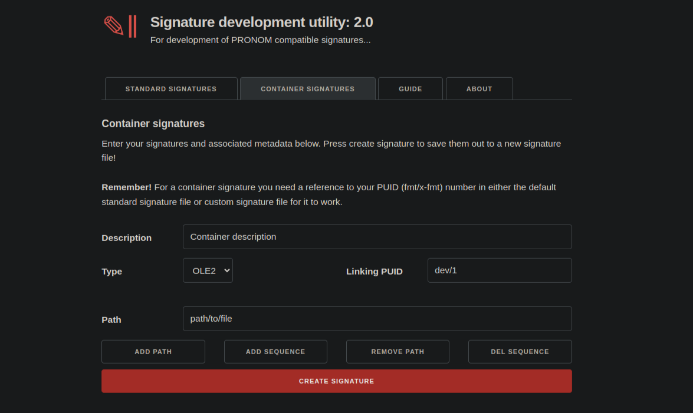

:::::::::::::::::::::::::::::::::::::: questions

* TODO

::::::::::::::::::::::::::::::::::::::::::::::::

::::::::::::::::::::::::::::::::::::: objectives

* TODO

::::::::::::::::::::::::::::::::::::::::::::::::

# Task: Creating and Testing Container Signatures

* 20 mins..

*  Manually create your signatures using template.s

FFDev.info [https://ffdev.info/](https://ffdev.info/) provides a form for ease of creation of standard and container signature files.

**

* To use new signatures they will need to be added to the right folders in the droid config:

Binary and Container signatures are contained in separate folder within the
.droid6 folder. This folder is likely hidden at the root of your user folder.
Signatures must have a unique signature version number at the beginning of the
XML so as not to conflict with other signature files. These can be manually
moved into these folders or regular signature loaded within DROID.

If you are using Siegfried, you can use the Roy tool to build a new signature
using your new signatures.

NB. see the try-it section of ffdev.info...

`$ROOT/$USERHOME/.droid6/…`

* ... denotes ... Hidden Folder

20 mins

<!-- NB. Keypoints should appear at the end of the markdown file. Aesthetically
     it looks like it's better with an additional newline so adding that
     here and using this comment as a separator to make it easy to read
     content.
-->

 

::::::::::::::::::::::::::::::::::::: keypoints

* TODO...

::::::::::::::::::::::::::::::::::::::::::::::::
