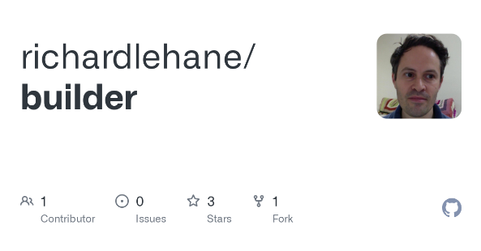
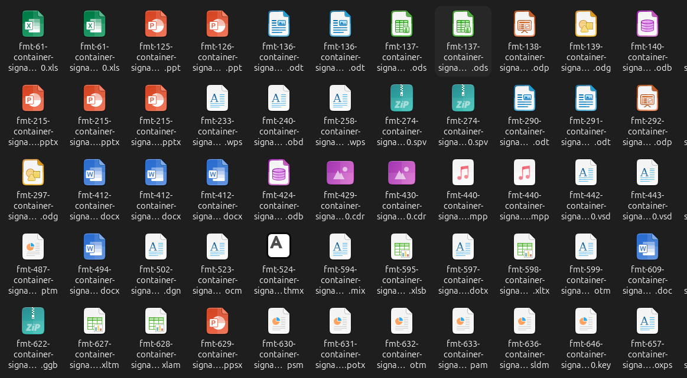

:::::::::::::::::::::::::::::::::::::: questions

* TODO

::::::::::::::::::::::::::::::::::::::::::::::::

::::::::::::::::::::::::::::::::::::: objectives

* TODO

::::::::::::::::::::::::::::::::::::::::::::::::

<!-- TODO: Advanced topic we might not practically cover but you need to
know about -->

# Testing signatures

We want to identify **false-positives** and **collisions**.

* False-positives are files that are identifying incorrectly using the
signature.
* False-positives are resolved through careful testing of signatures against
existing patterns using tools like the skeleton suite (below).
*  Collisions are a subset because they might occur because they are a subset
of a file format, e.g. SVG might collide with XML
* Collisions are resolved through a directive in PRONOM to give piriority of one
format over the other. The ideal - one format identificaiton per file, i.e.
no multiple identification.

## Skeleton suite

The skeleton suite can help us to do this.

The skeleton suite is ...

> info box:

Builder: Current Skeletons, Maintained by Richard Lehane

* Updated when a new PRONOM is released
* Contains standard and container skeleton samples.

> https://github.com/richardlehane/builder

{alt="TODO"}

> info box:

[https://github.com/exponential-decay/skeleton-test-suite-generator](https://github.com/exponential-decay/skeleton-test-suite-generator)

{alt="TODO"}

<!-- NB. Keypoints should appear at the end of the markdown file. Aesthetically
     it looks like it's better with an additional newline so adding that
     here and using this comment as a separator to make it easy to read
     content.
-->

 

::::::::::::::::::::::::::::::::::::: keypoints

* TODO...

::::::::::::::::::::::::::::::::::::::::::::::::
