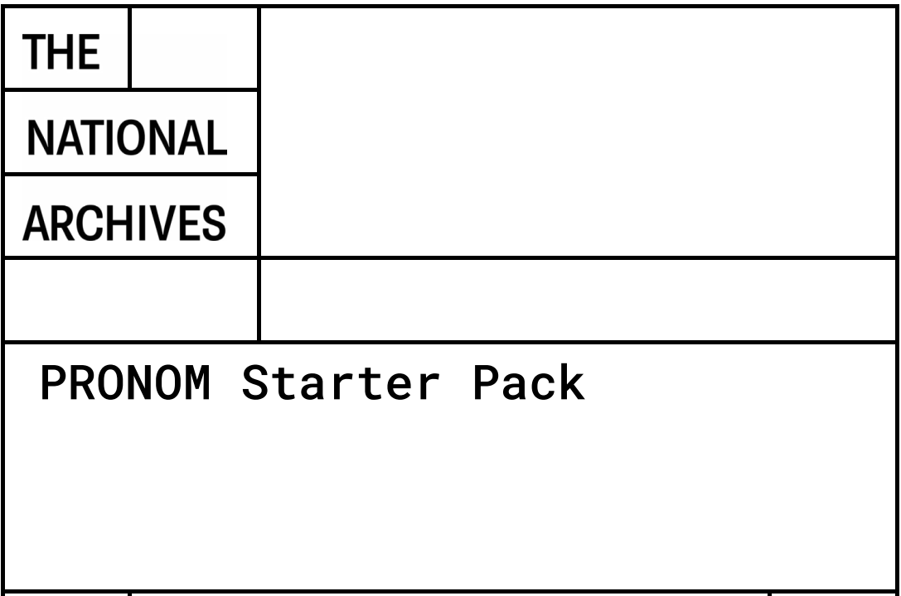
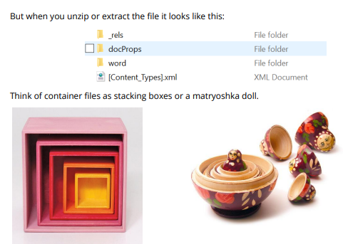
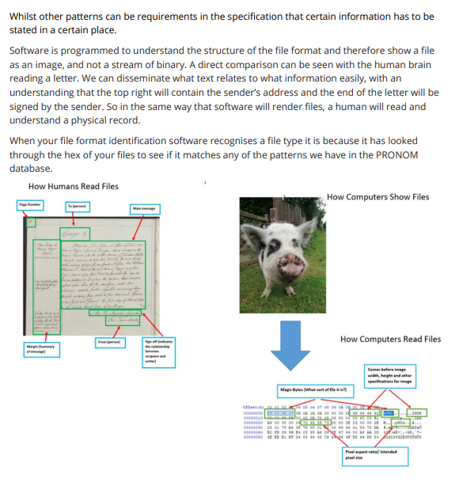

:::::::::::::::::::::::::::::::::::::: questions

* TODO

::::::::::::::::::::::::::::::::::::::::::::::::

::::::::::::::::::::::::::::::::::::: objectives

* TODO

::::::::::::::::::::::::::::::::::::::::::::::::

# Final Topics

## Contact us

Reach out in-person by email, or via one of our groups and community resources.

* Email: [pronom@nationalarchives.gov.uk](mailto:pronom@nationalarchives.gov.uk)
* Google Groups: [PRONOM \- Google Groups](https://groups.google.com/g/pronom)
* GitHub- [https://github.com/digital-preservation/PRONOM\_Research](https://github.com/digital-preservation/PRONOM_Research)

And our bi-weekly PRONOM Open Drop-In!

## Resources

* The main PRONOM website can be found here:
www.nationalarchives.gov.uk/PRONOM.
* Ross Spencer's signature development utility for both binary and
container signatures can be found here.
* A list of blogs, presentations, and other resources to assist with
PRONOM research and file format signature development can be found here.
* If you would like help or advice on conducting your research, crafting
your submission, creating a signature, or if you're having difficulty
finding samples, please create a conversation thread on our Google Group.
* Here is the full list of everything in PRONOM as of the v108 release
on 5 September 2022. From here you can see which formats don't currently
have MIME/Media types, lists of associated extensions, deprecated formats
and formats that have signatures (including container signatures).
* Here is a list of PUIDs that currently lack signatures. Can you help
sourcing example files and suggesting potential identification signatures?
* Here is a list of PUIDs that currently only have an 'outline'
description. Can you help us with some suggestions for PRONOM descriptive
text entry? Descriptions should be objective descriptions of what the
format does and can include information about its originating software
and so should not contain qualitative information, such as '...is the
best format for...'.
* Here is a list of files which we are looking for samples of, or
information about. Can you help by providing some, or point us in the
direction of where we can find them?

## PRONOM starter pack

Get started wit the PRONOM starter pack!

## Useful links

https://linktr.ee/pronom.whats.in.the.box

::::::::::::::::::::::::::::::::::::: keypoints

* TODO...

::::::::::::::::::::::::::::::::::::::::::::::::

